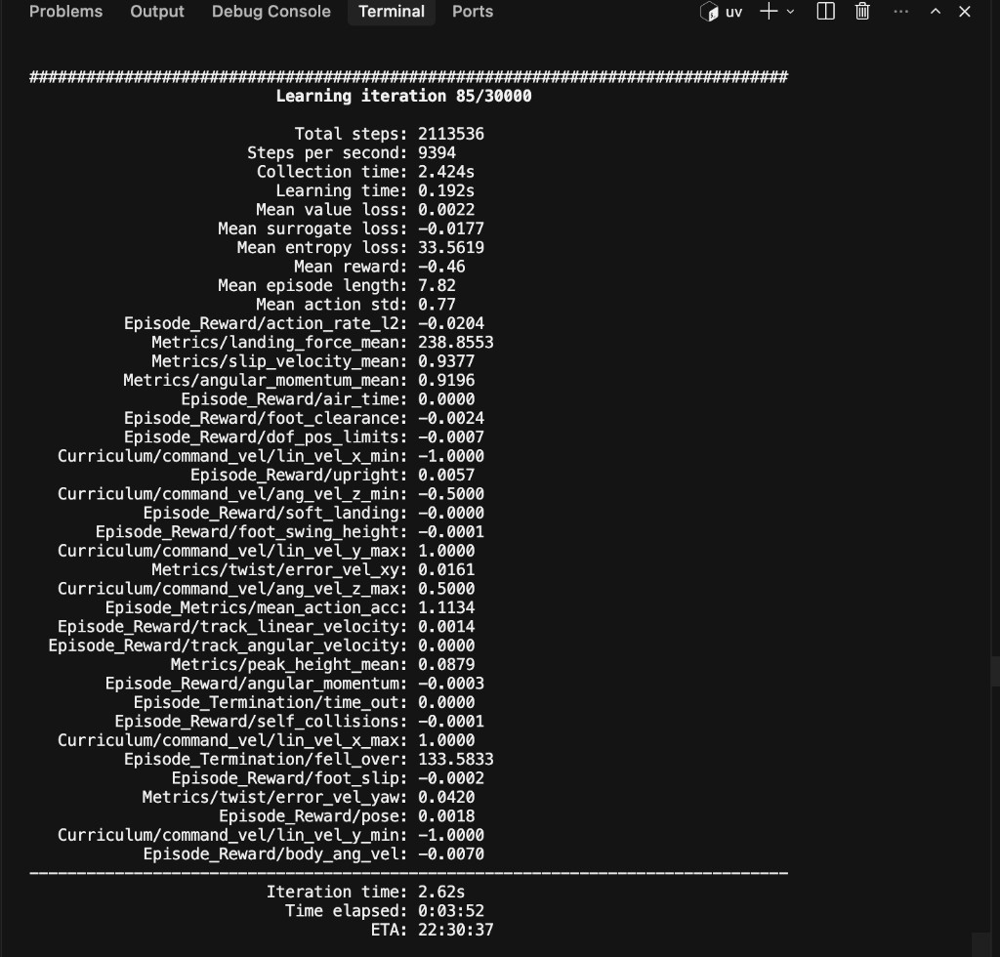
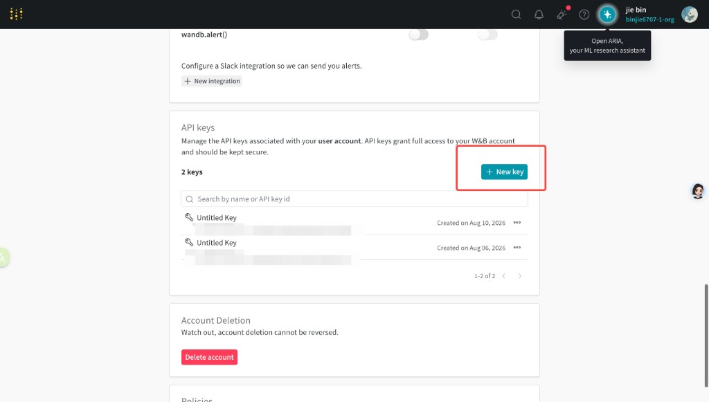

# mjlab 从安装到启动训练（小白版）

这份文档带你从零把环境配好，并启动 **Unitree G1** 的速度跟踪训练。  
按顺序做即可；每一步都可以复制粘贴命令。

> 本仓库基于 [mjlab](https://github.com/mujocolab/mjlab)，训练需要 **Linux + NVIDIA GPU**。

---

## 0. 你需要准备什么

| 项目 | 要求 | 怎么检查 |
|------|------|----------|
| 系统 | Linux（推荐 Ubuntu 22.04） | `uname -a` |
| GPU | NVIDIA 显卡（训练用） | `nvidia-smi` |
| 驱动 | 建议支持 CUDA 12.0+（驱动 ≥ 525） | `nvidia-smi` 右上角 `CUDA Version` |
| 磁盘 | 建议预留 **20GB+**（PyTorch + CUDA 包很大） | `df -h .` |
| 网络 | 能访问 PyPI / download.pytorch.org | 见下文“下载很慢” |

先确认 GPU 正常：

```bash
nvidia-smi
```

能看到 GPU 名称（例如 `Tesla T4`、`RTX 4090`）就说明驱动 OK。  
如果提示 `nvidia-smi: command not found`，需要先安装 NVIDIA 驱动，再继续。

---

## 1. 获取代码

```bash
cd ~/workspace   # 或你喜欢的目录
# 若还没有仓库，先 clone；已有则可跳过
# git clone <你的仓库地址> unitree_G1
cd unitree_G1
```

后面所有命令都默认在仓库根目录执行：

```bash
cd /home/ubuntu/workspace/unitree_G1
```

---

## 2. 安装包管理器 uv

本项目用 **uv** 管理 Python 环境，不要用系统自带的 `pip install` 乱装。

```bash
curl -LsSf https://astral.sh/uv/install.sh | sh
```

安装后让当前终端能找到 `uv`：

```bash
source "$HOME/.local/bin/env"
uv --version
```

如果新开终端又提示 `uv: command not found`，再执行一次上面的 `source`，或把下面这行写进 `~/.bashrc`：

```bash
echo 'source "$HOME/.local/bin/env"' >> ~/.bashrc
```

---

## 3. 安装系统图形库（无头服务器必做）

云服务器通常没有显示器。MuJoCo 默认用 **EGL** 做离屏渲染，需要系统里有 `libEGL.so.1`。  
只装了 NVIDIA 驱动、没装下面这些包时，训练一启动就会报：

```text
AttributeError: 'NoneType' object has no attribute 'eglQueryString'
```

用下面命令一次性装好（Ubuntu / Debian）：

```bash
sudo apt-get update
sudo apt-get install -y libegl1 libgl1 libopengl0 libegl-dev
```

---

## 4. 一键安装 Python 依赖（推荐）

仓库里有脚本 `install_for_gpu.sh`：会检测 GPU / 驱动，自动选择 `cu128` 或 `cpu`，再执行 `uv sync`。

### 4.1 先只检测，不安装

```bash
chmod +x ./install_for_gpu.sh
./install_for_gpu.sh
```

看输出里的「推荐 wheel」：

- `cu128`：用 GPU 训练（正常情况）
- `cpu`：驱动太旧或无法用 CUDA，只能 CPU（训练会很慢，一般不推荐）

### 4.2 正式安装

```bash
./install_for_gpu.sh --mjlab
```

这一步会下载 PyTorch、CUDA 相关库等，**体积很大（数 GB）**，第一次可能要十几分钟。  
脚本已默认：

- `UV_HTTP_TIMEOUT=300`（避免大包 30 秒超时）
- `UV_CONCURRENT_DOWNLOADS=4`（降低并行抢带宽）

成功时会看到类似：

```text
✓ mjlab ready. train with: ...
```

### 4.3 可选：预览将要执行的命令

```bash
./install_for_gpu.sh --dry-run --mjlab
```

---

## 5. 验证环境是否 OK

在仓库根目录执行：

```bash
# 1) MuJoCo 能否导入（检查 EGL）
uv run python -c "import mujoco; print('mujoco', mujoco.__version__, 'ok')"

# 2) PyTorch 能否用到 GPU
uv run python -c "import torch; print('torch', torch.__version__); print('cuda', torch.cuda.is_available()); print(torch.cuda.get_device_name(0) if torch.cuda.is_available() else 'no gpu')"

# 3) 跑官方 demo（可选，会启动演示）
# uv run demo
```

期望结果：

- `mujoco ... ok`
- `cuda True`
- 能打印出你的 GPU 名称

---

## 6. 启动训练（Unitree G1 速度跟踪）

### 6.1 最常用命令

```bash
uv run train Mjlab-Velocity-Flat-Unitree-G1 --env.scene.num-envs 1024
```

含义：

| 部分 | 说明 |
|------|------|
| `uv run train` | 用本仓库虚拟环境启动训练入口 |
| `Mjlab-Velocity-Flat-Unitree-G1` | 任务名：G1 在平坦地面跟踪速度命令 |
| `--env.scene.num-envs 1024` | 并行环境数量；越大越吃显存 |

### 6.2 并行环境数量怎么选

| GPU | 建议起点 | 说明 |
|-----|----------|------|
| Tesla T4（16GB） | `1024` | 显存/算力有限，先从这个数开始 |
| RTX 4090 / 更强卡 | `2048`～`4096` | 显存够可以加大 |
| 显存不够 / OOM | 减半再试 | 例如 `1024` → `512` → `256` |

第一次启动时，MuJoCo Warp 会在 GPU 上编译内核，终端可能刷很多 `Module ... load on device 'cuda:0' took ... ms`，**这是正常现象**，等几分钟后会出现训练迭代日志。

### 6.3 查看有哪些任务

```bash
uv run list-envs
```

### 6.4 常用可选参数

```bash
# 指定用哪张 GPU（默认一般是 GPU 0）
uv run train Mjlab-Velocity-Flat-Unitree-G1 \
  --env.scene.num-envs 1024 \
  --gpu-ids "[0]"

# 多卡（例如 0 和 1）
uv run train Mjlab-Velocity-Flat-Unitree-G1 \
  --env.scene.num-envs 1024 \
  --gpu-ids "[0, 1]"

# 查看该任务全部可调参数
uv run train Mjlab-Velocity-Flat-Unitree-G1 --help
```

### 6.5 训练日志在哪

默认写在：

```text
logs/rsl_rl/<实验名>/<时间戳>/
```

可用 TensorBoard 查看（另开一个终端）：

```bash
uv run tensorboard --logdir logs/rsl_rl
```

浏览器打开提示的地址即可（云服务器需自己做端口转发）。

### 6.6 训练过程中终端输出怎么读

登录 W&B 之后（或选择不可视化后），终端会周期性打印类似下面的表格。  
**第一次启动**还会先刷很多 `Module ... load on device 'cuda:0'`，那是 GPU 在编译仿真内核，等几分钟就会出现迭代日志。

示例（Learning iteration 85/30000）：



下面按区块解释。数值会随训练变化，**早期 reward 为负、经常摔倒都正常**。

#### 总览（表格最上方）

| 字段 | 含义 | 怎么看 |
|------|------|--------|
| `Learning iteration 85/30000` | 当前是第 85 轮，一共计划 30000 轮 | 分母可在配置里改；跑完才算完整训练 |
| `Total timesteps` | 到目前为止环境交互的总步数 | 越大说明采到的经验越多 |
| `Steps per second` | 每秒仿真/交互步数 | 越大越快；和 GPU、`num-envs` 有关 |
| `Collection time` | 本轮从环境采集数据花的时间 | 通常占大头 |
| `Learning time` | 本轮更新神经网络花的时间 | 相对较短属正常 |
| `Iteration time` | 本轮总耗时 ≈ 采集 + 学习 | 可用来估算整体进度 |
| `Mean value loss` | 价值网络（Critic）拟合回报的误差 | 总体应逐渐变小/稳定，偶尔跳动正常 |
| `Mean surrogate loss` | PPO 策略损失 | 可正可负，单独看绝对值意义不大，看趋势 |
| `Mean entropy loss` | 策略熵（探索程度） | 偏高 = 动作更随机；训练中后期常会下降 |
| `Mean reward` | 回合平均回报 | **越来越高越好**；早期负值很常见 |
| `Mean episode length` | 平均存活步数 | 越长通常越好（少摔倒、能站更久） |
| `Mean action noise std` / `Mean action std` | 动作探索噪声大小 | 训练中常随配置衰减 |
| `Mean compute time`（若有） | 本轮计算相关耗时 | 监控性能用 |
| `Mean total time`（若有） | 本轮总时间 | 同 Iteration time |
| `ETA` | 按当前速度预估剩余时间 | 只是估计，会随速度变化 |

#### Episode_Reward/（各项奖励拆解）

这些是组成总 reward 的零件。名字前的符号在配置里体现为权重：正数鼓励、负数惩罚。  
日志里打印的是**该项对回报的贡献**（已含权重后的统计）。

| 名称 | 含义（通俗） |
|------|----------------|
| `track_linear_velocity` | 跟得上前进/侧移速度命令 → 越高越好 |
| `track_angular_velocity` | 跟得上转弯（偏航角速度）命令 → 越高越好 |
| `upright` | 躯干是否立得住 → 越高越好 |
| `pose` | 姿态是否接近默认/自然站姿 → 越高越好 |
| `body_ang_vel` | 身体乱晃的惩罚 → 绝对值过大不好 |
| `angular_momentum` | 躯干角动量过大的惩罚 |
| `dof_pos_limits` | 关节顶到限位的惩罚 |
| `action_rate_l2` | 动作变化过猛（抽搐）的惩罚 |
| `air_time` | 与脚腾空时间相关（步态） |
| `foot_clearance` | 抬脚高度不够等的惩罚 |
| `foot_swing_height` | 摆动腿高度相关项 |
| `foot_slip` | 该站稳时脚打滑的惩罚 |
| `soft_landing` | 落地冲击过大的惩罚 |
| `self_collisions` | 自己胳膊腿互相碰撞的惩罚 |

小白怎么盯：

1. **先看** `Mean reward`、`Mean episode length` 是否慢慢变好。  
2. **再看** `track_linear_velocity` / `upright` 是否上升。  
3. 某一惩罚项长期很大（很负），再针对该项调权重或查机器人是否总在摔/打滑。

#### Curriculum/（课程学习：命令难度）

训练不会一上来就要求很高速度，而是在一个速度范围内采样命令。常见字段：

| 名称 | 含义 |
|------|------|
| `lin_vel_x min/max` | 前后速度命令范围（m/s） |
| `lin_vel_y min/max` | 左右速度命令范围（m/s） |
| `ang_vel_z min/max` | 转弯角速度命令范围（rad/s） |

范围随课程变宽，说明任务在变难。图中大约是前后/左右 ±1.0、转弯 ±0.5。

#### Metrics/（额外指标）

| 名称 | 含义（通俗） |
|------|----------------|
| `twist/error_vel_xy` | 平面线速度跟踪误差 → **越小越好** |
| `twist/error_vel_yaw` | 转弯速度跟踪误差 → **越小越好** |
| `landing_force_mean` | 平均落地力 |
| `slip_velocity_mean` | 平均打滑速度 |
| `angular_momentum_mean` | 平均角动量大小 |
| `peak_height_mean` | 脚抬起峰值高度一类统计 |
| `mean_action_acc` | 动作加速度（动作是否过于剧烈） |

#### Episode_Termination/（回合为什么结束）

| 名称 | 含义 |
|------|------|
| `time_out` | 撑满最长回合时间正常结束（偏「活得久」） |
| `fell_over` | 摔倒导致结束 |

训练初期 `fell_over` 很高、`time_out` 接近 0 很常见。  
后期理想趋势：`fell_over` 下降，`time_out` 上升，同时速度跟踪误差变小。

#### 看到这些不要慌

- 编译内核很慢、前几百轮 reward 很差 → 正常。  
- ETA 显示二十多小时 → 与 `30000` 轮和当前步速有关；可先跑着观察曲线，不必一次盯完。  
- 想提前停：终端里 `Ctrl+C`；检查点一般在 `logs/rsl_rl/...`（以及 W&B，若已登录）。

---

## 7. 登录 Weights & Biases（W&B）

训练启动后，终端可能会弹出 W&B 交互提示，用来把训练曲线上传到网页查看。  
**建议登录**（方便在浏览器看 loss / reward）；若选「不可视化」也能继续训练，只是没有云端看板。

### 7.1 训练时出现的提示

```text
wandb: (1) Create a W&B account
wandb: (2) Use an existing W&B account
wandb: (3) Don't visualize my results
wandb: Enter your choice:
```

按下面选择：

| 输入 | 含义 |
|------|------|
| `1` | 没有账号 → 去注册 |
| `2` | **已有账号（推荐）** → 接着粘贴 API key |
| `3` | 不登录，本地继续跑，不上传 W&B |

选择 `2` 后会提示：

```text
wandb: You can find your API key in your browser here: https://wandb.ai/authorize?ref=models
wandb: Paste an API key from your profile and hit enter, or press ctrl+c to quit:
```

### 7.2 在网页上创建 / 复制 API key

1. 浏览器打开：<https://wandb.ai/authorize>  
   （或：登录 [wandb.ai](https://wandb.ai/) → 右上角头像 → Settings → **API keys**）
2. 点击 **`+ New key`** 新建一把钥匙（也可使用已有 key）。
3. 复制生成的一长串 key（只显示一次，注意保存）。
4. 回到终端，**粘贴后回车**（粘贴时通常不显示字符，属正常）。

下图是 Settings 页面里 API keys 的位置，红框即为 **`+ New key`**：



### 7.3 登录成功长什么样

粘贴正确后，终端类似：

```text
wandb: Appending key for api.wandb.ai to your netrc file: /home/ubuntu/.netrc
wandb: Currently logged in as: <你的用户名> to https://api.wandb.ai
wandb: Tracking run with wandb version ...
```

之后同一台机器一般不用再输 key（保存在 `~/.netrc`）。

也可在训练前单独登录（效果相同）：

```bash
uv run wandb login
# 或：uv tool install wandb && wandb login
```

重新登录：

```bash
uv run wandb login --relogin
```

### 7.4 安全提醒

- API key **等于账号密码**，不要发到聊天群、不要提交进 git。
- 若 key 不慎泄露，到 W&B 网页删掉旧 key，再新建一把。

---


## 8. 常见问题速查

### Q1：下载超时 / `UV_HTTP_TIMEOUT (current value: 30s)`

大包（如 `nvidia-cusparse-cu12`、`torch`）下载慢时，uv 默认 30 秒会超时。  
当前脚本已默认加到 300 秒。若你手动跑 `uv sync`，可以：

```bash
export UV_HTTP_TIMEOUT=300
export UV_CONCURRENT_DOWNLOADS=4
uv sync --extra cu128
```

中断后重新执行安装即可，已下载的包会走缓存。

### Q2：`eglQueryString` / OpenGL EGL 报错

回到 **第 3 步**，安装 `libegl1` 等系统库。

### Q3：`uv: command not found`

```bash
source "$HOME/.local/bin/env"
```

### Q4：`CUDA out of memory` / 显存不足

减小并行环境数：

```bash
uv run train Mjlab-Velocity-Flat-Unitree-G1 --env.scene.num-envs 512
```

### Q5：脚本提示推荐 `cpu`，但我有 GPU

多半是驱动太旧，不支持 CUDA 12.x。先升级 NVIDIA 驱动，再重新：

```bash
./install_for_gpu.sh
./install_for_gpu.sh --mjlab
```

### Q6：想确认当前 GPU 会被装成什么

```bash
./install_for_gpu.sh          # 只检测
./install_for_gpu.sh --dry-run --mjlab   # 预览安装命令
```

---

## 9. 最短路径（抄这段就行）

假设你已经 `cd` 到仓库根目录，并且 `nvidia-smi` 正常：

```bash
# 1. 安装 uv
curl -LsSf https://astral.sh/uv/install.sh | sh
source "$HOME/.local/bin/env"

# 2. 无头服务器图形依赖
sudo apt-get update
sudo apt-get install -y libegl1 libgl1 libopengl0 libegl-dev

# 3. 安装 Python / CUDA 依赖
chmod +x ./install_for_gpu.sh
./install_for_gpu.sh --mjlab

# 4. 快速自检
uv run python -c "import torch, mujoco; print(torch.__version__, torch.cuda.is_available(), mujoco.__version__)"

# 5. 开始训练（T4 建议 1024）
uv run train Mjlab-Velocity-Flat-Unitree-G1 --env.scene.num-envs 1024
```

看到环境表（Observation / Reward / Termination）和 Warp 编译日志后，耐心等一会儿，训练就会开始。

---

## 10. 下一步可以看什么

- 官方文档：<https://mujocolab.github.io/mjlab/>
- 动作模仿训练：`docs/source/training/motion_imitation.rst`
- 多卡训练：`docs/source/training/distributed_training.rst`
- 评测已有策略：`uv run play Mjlab-Velocity-Flat-Unitree-G1 --wandb-run-path <你的run>`
